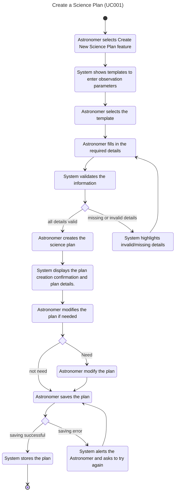

# **The Selected Use Cases**

1. Create a science plan  
2. Test a science plan  
3. Submit a science plan  
4. Create an observing program  
5. Access collected astronomical data  

---

## Class diagram

       
     

### **1. Create a Science Plan**

| **Use Case Name** | Create a Science Plan |
| ----- | ----- |
| **ID** | UC001 |
| **Importance Level** | High |
| **Primary Actor** | Astronomer |
| **Use Case Type** | Essential |
| **Stakeholders and Interests** | Astronomer: Wants to create an observation plan. Research Institution: Uses structured plans to schedule telescope time. System Administrator: Protects data quality and security. |
| **Brief Description** | The Astronomer prepares a science plan that outlines the observations to be made. |
| **Preconditions** | The Astronomer is signed in and allowed to create plans. |
| **Trigger** | The Astronomer starts a new plan. |
| **Type** | User-initiated |
| **Relationship** | Association: Astronomer Extend: – Include: – Generalization: – |
| **Normal Flow of Events** | 1. The Astronomer selects “Create New Science Plan” feature. 2. The system shows templates to enter observation parameters. 3. The Astronomer selects the template. 4. The Astronomer fills in the required details. 5. The system validates the information. 6.If all details are valid, the Astronomer creates the science plan. 7. The system displays the plan creation confirmation and plan details. 8. The Astronomer modifies the plan if needed. 9. The Astronomer saves the plan. 10. The system stores the science plan successfully. |
| **Subflow** | 5a. If all information passes validation, the system continues to step 6. 5b. If details are missing or invalid, the system highlights the issues and returns to Step 4 for correction. 8a. If astronomer don't need to modify the plan, continues to step 9. 8b. If astonomer want to modify the plan, the astronomer modify before continues to step 9.  9a. If the plan is saved successfully, the system confirms and stores it in the database. |
| **Alternate / Exceptional Flow** | 9b. If an error occurs during saving, the system alerts the Astronomer and requests them to try saving again. |
| **Postconditions** | The Science Plan is created successfully and ready to proceed. The Science Plan is stored and can be scheduled later. |

## Activity Diagram

## Sequence Diagram

---

### **2. Test a Science Plan**

| **Use Case Name** | Test a Science Plan |
| ----- | ----- |
| **ID** | UC002 |
| **Importance Level** | High |
| **Primary Actor** | Astronomer |
| **Use Case Type** | Essential |
| **Stakeholders and Interests** | Astronomer: Wants to check feasibility and expected results before submission. Science Observer: Prefers tested plans to simplify validation. |
| **Brief Description** | The Astronomer simulates the plan to verify accuracy and expected observation flow before submission. |
| **Preconditions** | The Astronomer has already created and saved a draft plan with required details. |
| **Trigger** | The Astronomer clicks on “Test a Plan” to check feasibility. |
| **Type** | External |
| **Relationship** | Association: Astronomer Include: Operate the Interactive Observing (Virtual Telescope) Extend: – Generalization: – |
| **Normal Flow of Events** | 1. The Astronomer selects the feature to test the saved plan. 2. The Astronomer selects plan to test. 3. The system loads the saved plan into the virtual telescope environment. 4. The system checks that all required parameters are present. 5. The Astronomer starts the simulation run. 6. The system processes the plan and checks for inconsistencies. 7. The system displays conflicts, predicted coverage, warnings, and results. 8. The Astronomer review the result. 9. The system shows tested completed message that the plan is ready for submission. |
| **Subflow** | 4a. If all required parameters are present, continue to Step 5. 4b. If parameters are missing or invalid, the system highlights the issues and returns to Step a after the Astronomer edits and saves the plan. 8a. If the results are acceptable, the system shows test completed message that the plan is ready for submission. 8b. If the results are not acceptable, the Astronomer edit the plan’s parameters and returns to Step 5.|
| **Alternate / Exceptional Flow** |  |
| **Postconditions** | The Astronomer has a verified and improved version of the plan ready for submission. |

## Activity Diagram

## Sequence Diagram

---

### **3. Submit a Science Plan**

| **Use Case Name** | Submit a Science Plan |
| ----- | ----- |
| **ID** | UC003 |
| **Importance Level** | High |
| **Primary Actor** | Astronomer |
| **Use Case Type** | Essential |
| **Stakeholders and Interests** | Astronomer: Wants the plan to be submitted so it can be executed on the telescope. Research Institution: Uses submitted plans to schedule observations. |
| **Brief Description** | The Astronomer submits a validated science plan so it can be scheduled for execution. |
| **Preconditions** | A validated science plan exists and has been tested. |
| **Trigger** | The Astronomer chooses to submit the plan. |
| **Type** | External |
| **Relationship** | Association: Astronomer Extend: – Include: – Generalization: – |
| **Normal Flow of Events** | 1. The Astronomer select a submit science plan feature. 2. The astronomer loads a tested science plan. 3. The Astronomer prepare a plan for submission. 4. The system checks whether all required approvals are in place.  5. The Astronomer confirms the submission. 6. The system creates a scheduling request for the approved plan. |
| **Subflow** | 4a. If all required approvals and data pass validation, continues to step 5 4b. If required approvals are missing, the system shows the invalid parameter, let astronomer to modify, and return to step 3. 5a. If the submission is successful, continues to step 6 |
| **Alternate / Exceptional Flow** | 5b. If a system error occurs during submission, the system alerts the Astronomer and requests them to try again.|
| **Postconditions** | The plan is submitted and ready for future implementation. |

## Activity Diagram

## Sequence Diagram

    

---

### **4. Create an Observing Program**

| **Use Case Name** | Create an Observing Program |
| ----- | ----- |
| **ID** | UC004 |
| **Importance Level** | High |
| **Primary Actor** | Science Observer |
| **Use Case Type** | Essential |
| **Stakeholders and Interests** | Science Observer – Wants to transform the science plan into an observing program that can be carried out in real practice. Astronomer – Wants to provide data from the science plan to be used correctly in building the observing program. |
| **Brief Description** | The Science Observer creates an observing program from a validated science plan that can be executed on the telescope. |
| **Preconditions** | The user must log in and be authenticated as the authorized Science Observer before accessing the system. |
| **Trigger** | The Science Observer chooses to create an observing program from a validated science plan. |
| **Type** | External |
| **Relationship** | Association: Science Observer Extend: – Include: – Generalization: – |
| **Normal Flow of Events** | 1. The Science Observer selects a create an observing program feature. 2. The Science Observer selects a validated science plan to convert it into an observing program. 3. The system shows the details of the selected plan and related data sets. 4. The Science Observer creates a new observing program. 5. The Science Observer sets parameter values (e.g., magnification, light level, and interpupillary distance). 6. The Science Observer confirms the creation. 7. The system verifies observing program whether the defined parameters match the telescope’s technical requirements. 8. The Science Observer saves the observing program if parameters are valid. 9. The system displays the confirmed observing program information. |
| **Subflow** | 7a. If parameters are valid, continue to Step 8. 7b. If parameters are invalid, the system highlights the issue and returns to Step 5 for corrections. 8a. If the saving is successful, the system displays confirmed observing program information. |
| **Alternate / Exceptional Flow** | 8b. If a saving error occurs while creating the observing program, the system alerts the Science Observer and asks them to retry. |
| **Postconditions** | The Science Observer successfully creates and saves the observing program. The confirmed observing program is stored in the system for future implementation. |

## Activity Diagram

## Sequence Diagram

---

### **5. Access Collected Astronomical Data**

| **Use Case Name** | Access Collected Astronomical Data |
| ----- | ----- |
| **ID** | UC005 |
| **Importance Level** | High |
| **Primary Actor** | Astronomer |
| **Use Case Type** | Essential |
| **Stakeholders and Interests** | Astronomer – Wants to view, download, or analyze collected astronomical data from completed science plans. |
| **Brief Description** | The Astronomer accesses collected observation data to perform analysis. |
| **Preconditions** | The science plan must be completed, and data must already be collected and stored in the system. |
| **Trigger** | The Astronomer accesses archived data from past observations. |
| **Type** | External |
| **Relationship** | Association: Astronomer Extend: – Include: – Generalization: – |
| **Normal Flow of Events** | 1. The Astronomer selects data access feature. 2. The Astronomer enters search filters (e.g., dataID, programID). 3. The system displays matching datasets. 4. The Astronomer selects the desired files. 5. System displays file details with the download link. 6. The Astronomer downloads the data.|
| **Subflow** | 2a. If matching data is found, continue to step 3. |
| **Alternate / Exceptional Flow** | 2b. If no data is found, the system shows “No results found” and returns to Step 2. |
| **Postconditions** | The selected astronomical data has been successfully downloaded by the Astronomer. The system logs the access event for traceability. |

## Activity Diagram

## Sequence Diagram

    
